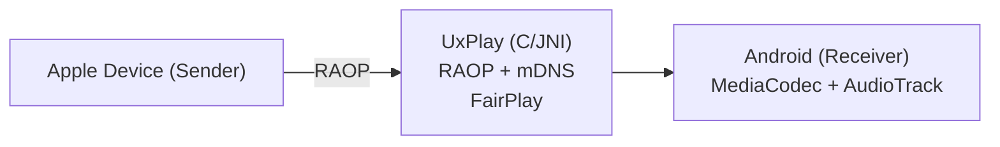

# AirPlay Receiver for Android — TV-box hardened fork

> Fork of [jqssun/android-airplay-server](https://github.com/jqssun/android-airplay-server) (itself based on
> [UxPlay](https://github.com/FDH2/UxPlay)), hardened for cheap **Amlogic Android TV boxes**. Validated on
> **X96Air_P2** (Amlogic, Android 9). GPL-3.0.

## ⚡ Quick install (no build needed)

1. Download the latest **`app-debug.apk`** from the [**Releases**](https://github.com/ltminh88/airplay-tv-receiver/releases) page.
2. Sideload onto the TV box:
   ```bash
   adb connect <box-ip>:5555          # enable "Network debugging" in Developer options first
   adb install -r app-debug.apk
   adb shell monkey -p io.github.jqssun.airplay -c android.intent.category.LAUNCHER 1
   ```
3. On the Mac/iPhone: **Screen Mirroring → "Android AirPlay"**. Done — Android 8.0+ required.

## What this fork adds (vs upstream)

- **Anti-freeze:** larger decoder backlog (`MAX_PENDING=24`) so high-bitrate bursts no longer panic-clear and
  reset to a soft/frozen image (the old build needed a manual reconnect). Faster stall watchdog (2s).
- **GL sharpening:** a GLES2 unsharp-mask stage (`GlSharpenRenderer`) keeps text crisp even when macOS drops to
  low bitrate on a static screen. Toggle + strength via prefs (default strength **30**). Falls back to direct
  rendering if GL init fails (never black-screens).
- **Amlogic decoder tuning:** sets the `4k-osd` decoder key; advertises `AppleTV6,2` in the AirPlay handshake.
- Full findings & rationale: [`docs/airplay-receiver-summary.md`](docs/airplay-receiver-summary.md).

## Build from source

Requires Android Studio JBR (JDK 17), Android SDK 35, NDK `27.0.12077973`, CMake. First build compiles OpenSSL
from source (~slow). Submodules **must** be initialised.

```bash
git submodule update --init --recursive
JAVA_HOME="/Applications/Android Studio.app/Contents/jbr/Contents/Home" ./gradlew assembleDebug
# APK -> app/build/outputs/apk/debug/app-debug.apk
```
The **debug** APK is the distributable one (debug-signed → sideload-installable). A release build needs your own
keystore in `local.properties` (`storeFile/storePassword/keyAlias/keyPassword`) and enables minify.

## Adjust sharpening on-device (no rebuild)

Sharpening reads two prefs in `shared_prefs/settings.xml` (`sharpen_enabled` bool, `sharpen_strength` int 0–100,
default 30). To change strength:
```bash
adb shell am force-stop io.github.jqssun.airplay
printf "<?xml version='1.0' encoding='utf-8' standalone='yes' ?>\n<map>\n  <int name=\"sharpen_strength\" value=\"40\" />\n</map>\n" > /tmp/settings.xml
adb push /tmp/settings.xml /data/local/tmp/settings.xml
adb shell run-as io.github.jqssun.airplay cp /data/local/tmp/settings.xml /data/data/io.github.jqssun.airplay/shared_prefs/settings.xml
adb shell monkey -p io.github.jqssun.airplay -c android.intent.category.LAUNCHER 1
```
Higher = sharper but harsher; 30 is a comfortable reading default.

## Known limitations (Amlogic box + AirPlay-1)

- **Static-screen softness:** macOS sends very low bitrate (~50 kbps) when the screen is static — inherent to
  AirPlay-1 adaptive encoding (AirScreen behaves the same). GL sharpening mitigates it; it cannot be forced higher.
- **Sustained high-motion video** (e.g. YouTube fullscreen) can still wedge the Amlogic HW decoder → disconnect +
  reconnect to clear.
- **Boot auto-start** is implemented but the X96Air_P2 ROM does not deliver boot broadcasts to sideloaded apps —
  open the app once after a reboot.
- A **fresh clone elsewhere** can't fetch the UxPlay submodule's `AppleTV6,2` commit (it lives only locally / not on
  FDH2/UxPlay). Re-apply the `lib/global.h` change or fork UxPlay if cloning to a new machine.

---

[](https://github.com/jqssun/android-airplay-server)
[](https://github.com/jqssun/android-airplay-server/releases)
[](https://github.com/jqssun/android-airplay-server/blob/main/LICENSE)
[](https://github.com/jqssun/android-airplay-server/actions/workflows/apk.yml)
[](https://github.com/jqssun/android-airplay-server/releases)

A fully featured free and open-source implementation of AirPlay for Android that turns your device into an AirPlay-compatible display and speaker, based on [UxPlay](https://github.com/FDH2/UxPlay).

<video loop src='https://github.com/user-attachments/assets/77c827d3-4f4e-4cfa-8698-3aa8ae557d54' alt="demo" width="200" style="display: block; margin: auto;"></video>

## Features

- Screen mirroring with H.264 and H.265 (HEVC) video decoding
- Audio streaming with AAC-ELD, AAC-LC and ALAC audio decoding
- Music streaming with track information, cover art, and playback controls
- Support for Picture-in-Picture, automatic resolution and mode switching
- Optional PIN authentication
- Video resolution, overscan, and frame rate control
- Audio latency control and support for software decoder fallback
- Debug overlay with real-time statistics (FPS, bitrate, codec, resolution, frame count, audio volume, etc.)
- Android native media session integration with notification controls

> [!WARNING]
> DRM content (e.g. from the Apple TV application) is not supported.

## Compatibility

- Android 8.0+
- Devices on the same subnet

## Implementation

This application uses the C-based [UxPlay](https://github.com/FDH2/UxPlay) library to implement the AirPlay/RAOP protocol, with a JNI bridge to the Android application layer. Audio is decoded via Android MediaCodec (AAC) or the Apple ALAC decoder (software fallback). Video is decoded via MediaCodec and rendered to a SurfaceView.



CMake is used for native C/C++ components under [`app/src/main/cpp`](app/src/main/cpp). Submodules must be initialized before building. 

```bash
git submodule update --init --recursive
./gradlew assembleDebug
```

Check out the [CI](https://github.com/jqssun/android-airplay-server/blob/main/.github/workflows/apk.yml) for more details on reproducible builds.

## Credits

- [UxPlay](https://github.com/FDH2/UxPlay) for the AirPlay/RAOP server implementation
- [ALAC](https://github.com/macosforge/alac) for the lossless audio decoder


---

Disclaimer: This project is not affiliated with Apple Inc.
