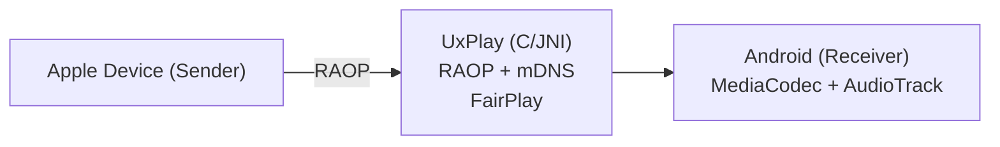

# AirPlay Receiver for Android — TV-box hardened fork

> Fork of [jqssun/android-airplay-server](https://github.com/jqssun/android-airplay-server) (itself based on
> [UxPlay](https://github.com/FDH2/UxPlay)), hardened for cheap **Amlogic Android TV boxes**. Validated on
> **X96Air_P2** (Amlogic, Android 9). GPL-3.0.

## ⚡ Quick install (no build needed)

1. Download the latest **`app-debug.apk`** from the [**Releases**](https://github.com/ltminh88/airplay-tv-receiver/releases) page.
2. Sideload onto the TV box:
   ```bash
   adb connect <box-ip>:5555          # enable "Network debugging" in Developer options first
   adb install -r app-debug.apk
   adb shell monkey -p io.github.jqssun.airplay -c android.intent.category.LAUNCHER 1
   ```
3. On the Mac/iPhone: **Screen Mirroring → "Android AirPlay"**. Done — Android 8.0+ required.

## What this fork adds (vs upstream)

- **No corruption ("vỡ hình"), by design:** mirror video is delivered over TCP (reliable, in-order), so a frame is
  never lost on the wire — the only thing that broke the H.264 reference chain was *us* dropping a frame on a
  backlog overflow. The renderer now **never drops an input frame**: if the pipeline falls behind it applies
  **backpressure** (the TCP feed waits, so macOS throttles its send rate). See `VideoRenderer._enqueue`.
- **Low latency without corruption:** decode and display are decoupled — every frame is *decoded* (references
  intact) but stale frames are *released without display* to fast-forward to the newest (`LATENCY_SKIP_THRESHOLD`).
  Typing stays responsive even during a macOS multi-Mbps burst.
- **Colour polish (GPU-cheap):** a GLES2 pass (`GlSharpenRenderer`) applies mild **contrast + saturation** to
  counter the slightly washed-out low-bitrate stream. The expensive 5-tap unsharp is **off by default**
  (`sharpen_strength=0`) because the Amlogic Mali GPU can't sustain it at 1080p60 — it's a uniform-branched opt-in.
  Falls back to direct rendering if GL init fails (never black-screens).
- **Amlogic decoder tuning:** sets the `4k-osd` decoder key; FULL-range BT.709 SDR colour.
- Full findings & rationale: [`docs/airplay-receiver-summary.md`](docs/airplay-receiver-summary.md).

## Build from source

Requires Android Studio JBR (JDK 17), Android SDK 35, NDK `27.0.12077973`, CMake. First build compiles OpenSSL
from source (~slow). Submodules **must** be initialised.

```bash
git submodule update --init --recursive
JAVA_HOME="/Applications/Android Studio.app/Contents/jbr/Contents/Home" ./gradlew assembleDebug
# APK -> app/build/outputs/apk/debug/app-debug.apk
```
The **debug** APK is the distributable one (debug-signed → sideload-installable). A release build needs your own
keystore in `local.properties` (`storeFile/storePassword/keyAlias/keyPassword`) and enables minify.

## Adjust image on-device (no rebuild)

The GL pass reads four prefs in `shared_prefs/settings.xml`, all applied on the next codec start (reconnect):

| Pref | Type | Default | Meaning |
|------|------|---------|---------|
| `sharpen_enabled` | bool | `true` | Enable the GL pass (colour polish). `false` = pure direct-surface. |
| `sharpen_strength` | int 0–100 | `0` | Unsharp-mask sharpen. **0 = off** (recommended — the 5-tap is too heavy for this GPU at 60fps). |
| `sharpen_contrast` | int (percent) | `101` | Contrast multiplier ×1.01. 100 = neutral. |
| `sharpen_saturation` | int (percent) | `102` | Saturation multiplier ×1.02. 100 = neutral. |

Example — bump saturation a touch (stop the app first so it doesn't overwrite on exit):
```bash
PKG=io.github.jqssun.airplay
adb shell am force-stop $PKG
adb shell "run-as $PKG sh -c 'cd /data/data/$PKG/shared_prefs && sed -i \"s/sharpen_saturation\\\" value=\\\"[0-9]*\\\"/sharpen_saturation\\\" value=\\\"110\\\"/\" settings.xml'"
adb shell monkey -p $PKG -c android.intent.category.LAUNCHER 1
```
Contrast/saturation above ~115 quickly looks over-vivid/harsh on a TV; 101–102 is a calm, natural default.

## Known limitations (Amlogic box + AirPlay-1)

- **Static-screen softness:** macOS sends very low bitrate (~50 kbps) when the screen is static — inherent to
  AirPlay-1 adaptive encoding (AirScreen behaves the same). GL sharpening mitigates it; it cannot be forced higher.
- **Sustained high-motion video** (e.g. YouTube fullscreen) can still wedge the Amlogic HW decoder → disconnect +
  reconnect to clear.
- **Boot auto-start** is implemented but the X96Air_P2 ROM does not deliver boot broadcasts to sideloaded apps —
  open the app once after a reboot.
- **Sharpen (unsharp) is off by default** — the Mali GPU on these boxes can't sustain the 5-tap at 1080p60 (it
  throttled display to ~35fps → lag). Colour polish (contrast/saturation) is cheap and stays at 60fps.

## Changelog

### v0.1.0-tvbox (2026-07-02)
Root-caused and fixed the recurring "vỡ hình" (macroblock corruption) and lag under real use (multi-pane iTerm2):
- **Corruption fixed at the root.** Mirror is TCP, so frames are never lost on the wire — the corruption was
  self-inflicted by dropping frames on a backlog overflow (which broke the H.264 reference chain until macOS's rare
  next IDR). Replaced the drop-on-overflow with **backpressure**: never drop an input frame; let the TCP feed wait so
  macOS throttles instead. Removed the old restart-loop that turned corruption into a minute-long freeze.
- **Lag fixed.** Decouple decode from display: decode every frame (references intact) but **skip *displaying* stale
  frames** to fast-forward to the newest (`LATENCY_SKIP_THRESHOLD`). Input-to-display latency stays low even during
  a 4–7 Mbps burst.
- **GPU-appropriate image polish.** The 5-tap unsharp overloaded the Mali GPU (throttled to ~35fps → lag), so it's
  now **off by default**; the GL pass keeps only cheap **contrast (×1.01) + saturation (×1.02)** to de-wash the
  colour without the framerate hit. Optimised the GL renderer (reuse vertex buffer, no per-frame `eglMakeCurrent`).
- **Buildable from a fresh clone again.** The UxPlay submodule now pins the public tag **`v1.73.6`** (`21eef8df`)
  instead of a local-only commit, so `git submodule update --init --recursive` works anywhere.

### v0.0.9-tvbox (2026-06-19)
Initial TV-box hardening: async MediaCodec renderer, keyframe-resync, stall watchdog, GL unsharp sharpening,
`4k-osd` decoder key, FULL-range BT.709 colour, boot auto-start.

---

[](https://github.com/jqssun/android-airplay-server)
[](https://github.com/jqssun/android-airplay-server/releases)
[](https://github.com/jqssun/android-airplay-server/blob/main/LICENSE)
[](https://github.com/jqssun/android-airplay-server/actions/workflows/apk.yml)
[](https://github.com/jqssun/android-airplay-server/releases)

A fully featured free and open-source implementation of AirPlay for Android that turns your device into an AirPlay-compatible display and speaker, based on [UxPlay](https://github.com/FDH2/UxPlay).

<video loop src='https://github.com/user-attachments/assets/77c827d3-4f4e-4cfa-8698-3aa8ae557d54' alt="demo" width="200" style="display: block; margin: auto;"></video>

## Features

- Screen mirroring with H.264 and H.265 (HEVC) video decoding
- Audio streaming with AAC-ELD, AAC-LC and ALAC audio decoding
- Music streaming with track information, cover art, and playback controls
- Support for Picture-in-Picture, automatic resolution and mode switching
- Optional PIN authentication
- Video resolution, overscan, and frame rate control
- Audio latency control and support for software decoder fallback
- Debug overlay with real-time statistics (FPS, bitrate, codec, resolution, frame count, audio volume, etc.)
- Android native media session integration with notification controls

> [!WARNING]
> DRM content (e.g. from the Apple TV application) is not supported.

## Compatibility

- Android 8.0+
- Devices on the same subnet

## Implementation

This application uses the C-based [UxPlay](https://github.com/FDH2/UxPlay) library to implement the AirPlay/RAOP protocol, with a JNI bridge to the Android application layer. Audio is decoded via Android MediaCodec (AAC) or the Apple ALAC decoder (software fallback). Video is decoded via MediaCodec and rendered to a SurfaceView.



CMake is used for native C/C++ components under [`app/src/main/cpp`](app/src/main/cpp). Submodules must be initialized before building. 

```bash
git submodule update --init --recursive
./gradlew assembleDebug
```

Check out the [CI](https://github.com/jqssun/android-airplay-server/blob/main/.github/workflows/apk.yml) for more details on reproducible builds.

## Credits

- [UxPlay](https://github.com/FDH2/UxPlay) for the AirPlay/RAOP server implementation
- [ALAC](https://github.com/macosforge/alac) for the lossless audio decoder


---

Disclaimer: This project is not affiliated with Apple Inc.
